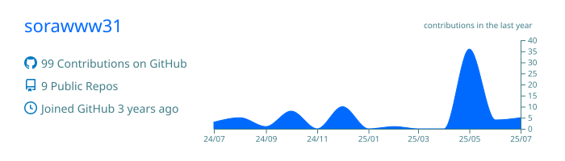
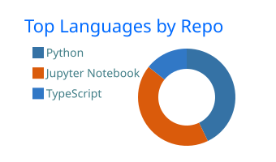
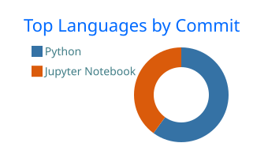
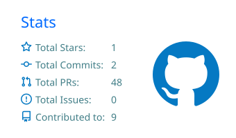
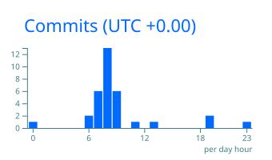

# Sora Koyama

## Profile

* **Name:** SORA KOYAMA
* **Affiliation:** Meiji University
* **Status:** 1st-year Master’s student
* **Lab:** Mathematical Optimization Laboratory
* **Research Interests:** Machine Learning, Deep Learning, Data Science, Mathematical Optimization
* **Hobbies:** Listening to bands, playing guitar

  * Electric Callboy
  * BABYMETAL
  * MAXIMUM THE HORMONE

## Machine Learning

I continually study to hone my skills and regularly build AI systems and machine learning models through Kaggle competitions, academic research, and internships.

**Python experience: 2 years**

* **Data types handled:**

  * Tabular data
  * Images
  * Audio
  * Natural language
  * Time-series data
* **Libraries & frameworks used:**

  * Numpy
  * Pandas
  * Matplotlib
  * Seaborn
  * scikit-learn
  * Gradient Boosting Decision Trees

    * LGBM
    * XGBoost
    * CatBoos
  * Deep Learning

    * PyTorch
    * TensorFlow
    * Keras
    * Transformers
    * Datasets
  * LLM development
    * GPT
    * Claude
    * Gemini
    * AutoGen (LLM Agent)
      
## Other Programming Languages

* C
* Java
* C++
* JavaScript

## Currently Studying

* Competitive Programming
* Data Science

## Other Tools

* Git
* GitHub
* Docker
* docker-compose

## Kaggle Competition
Competition Expert
https://www.kaggle.com/sorawww31
* NeurIPS 2024 - Lux AI Season 3 **Bronze Medal**
  * 92nd out of 701 teams
* CMI - Detect Behavior with Sensor Data **Bronze Medal**
  * 253rd out of 2657 teams

## Internship & Hackathon Experience
### Internship
EpicAI Inc. (August 2024 – Present)
https://epicai.co.jp/

CALTA HOLDINGS(June 2025)
https://cartaholdings.co.jp/

SoftBank Inc.(Augest 2025 - September 2025)
https://www.softbank.jp/corp/

### Hackathon
PKSHA TECHNOLOGY AI Agent Hackathon
https://www.pkshatech.com/

### Selected Project

**Design Drawing Automation Project**
Awarded the President’s Prize (top award) for developing an automated design-drawing system as part of the “Panasonic Accelerator by Electric Works Company.”
[https://prtimes.jp/main/html/rd/p/000006181.000003442.html](https://prtimes.jp/main/html/rd/p/000006181.000003442.html)

## GitHub Stats

 
 
