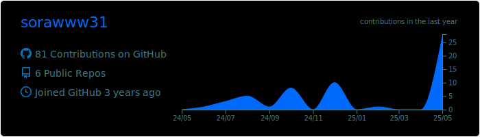
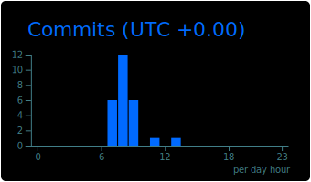

# 小山奏良
## Profile
- 氏名：小山奏良 (KOYAMA SORA)
- 所属：明治大学大学院 理工学研究科情報科学専攻
- 修士1年
- 数理最適化研究室
- 興味分野：機械学習, 深層学習, データサイエンス, 数理最適化

## 研究テーマ
### データポイズニング攻撃
データポイズニング攻撃とは、訓練データに少量のポイズンデータを挿入し、深層学習モデルを誤作動させる攻撃のこと

連続最適化理論を用いて、ポイズンデータとハイパーパラメータの関係性について研究中

## 機械学習
機械学習全般が好き。技術を磨くため常に勉強中。Kaggle、研究、インターンで日常的にAIシステムや機械学習を作成

**Python** 使用歴２年
- 使用データ
  + テーブル
  + 画像
  + 音声
  + 自然言語
  + 時系列データ
- 使用ライブラリ, フレームワーク
    + Numpy
    + Pandas
    + Matplotlib
    + Seaborn
    + scikit-learn
    + Gradient Boosting Decision Trees
      + LGBM
      + XGBoost
      + CatBoos
    + Deep Learning
      + Pytorch
      + Tensorflow
      + Keras
      + Transformers
      + Datasets
    + API
      + Twitter API
      + Azure OpenAI
      + CLOVA OCR
## その他経験言語
+ C言語
+ Java
+ C++
+ JavaScript
  
## 勉強中
競技プログラミング, データサイエンス

## その他ツール
+ Git
+ GitHub
+ Docker
+ docker-compose

## インターンシップ経験
株式会社EpicAI 2024年8月-現在
https://epicai.co.jp/
担当プロジェクト(抜粋)
### 設計図面の作図自動化プロジェクト
「Panasonic Accelerator by Electric Works Company」にて設計図面の作図自動化に向けた取り組みが評価され最優秀賞である社長賞を受賞

## Github統計
https://prtimes.jp/main/html/rd/p/000006181.000003442.html

 
 
